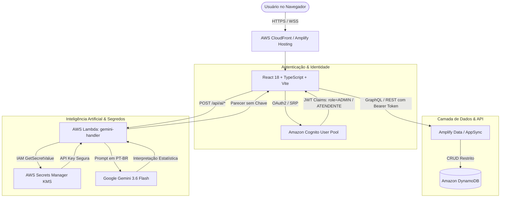

# Arquitetura Técnica do Sistema — Apoio ao Tratamento

## 1. Visão Geral da Arquitetura

O sistema **Apoio ao Tratamento** foi desenvolvido seguindo os mais rigorosos padrões de segurança, governança clínica e computação em nuvem na AWS.

---

## 2. Diagrama de Fluxo de Dados e Permissões

---

## 3. Estratégia de Isolamento e RBAC (Role-Based Access Control)

| Recurso / Rota | Perfil ADMIN | Perfil ATENDENTE | Ação de Bloqueio |
| :--- | :--- | :--- | :--- |
| `/dashboard` | Leitura Completa | Leitura Restrita/Pessoal | 200 OK |
| `/registrar-apoio` | Gravação Permitida | Acesso Proibido | 403 Forbidden |
| `/lancamentos` | CRUD + Soft Delete + Restore | Acesso Proibido | 403 Forbidden |
| `/atendentes` | Cadastro e Ativação | Acesso Proibido | 403 Forbidden |
| `/metas` | Versionamento e Ajuste | Acesso Proibido | 403 Forbidden |
| `/relatorios` | Exportação e Análise | Acesso Proibido | 403 Forbidden |
| `/usuarios` | Convite Cognito e Status | Acesso Proibido | 403 Forbidden |
| `/auditoria` | Visualização Total de Trilha | Acesso Proibido | 403 Forbidden |
| `/configuracoes` | Secrets Manager & Gemini | Acesso Proibido | 403 Forbidden |
| `/perfil` | Visualização e Troca Senha | Visualização e Troca Senha | 200 OK |

---

## 4. Auditoria Imutável

Todas as ações críticas no sistema geram dois tipos de registros:
1. **Auditoria de Apoios (`treatment_support_audit`)**:
   * Rastreia antes (`oldValue`) e depois (`newValue`) de cada registro.
   * Ações: `CREATE`, `UPDATE`, `DELETE`, `RESTORE`.
2. **Logs Globais do Sistema (`audit_logs`)**:
   * Rastreia autenticações, tentativas de login inválidas, convites e trocas de chave do Secrets Manager.
   * **Nenhum log armazena senhas, tokens ou chaves de API.**

---

## 5. Estratégia de Cache e Invalidação da Inteligência Artificial

1. **Cálculo Determinístico**: O backend é o único responsável pelos cálculos oficiais de volume, metas, médias, projeções e ritmo.
2. **Hash de Verificação**: Gera hash determinístico dos dados oficiais calculados. Se os dados não mudaram, a análise em cache é reutilizada instantaneamente.
3. **Invalidação Atômica**: Qualquer criação, edição, exclusão ou restauração de apoio invalida de imediato o cache das análises diária e mensal relacionadas.
